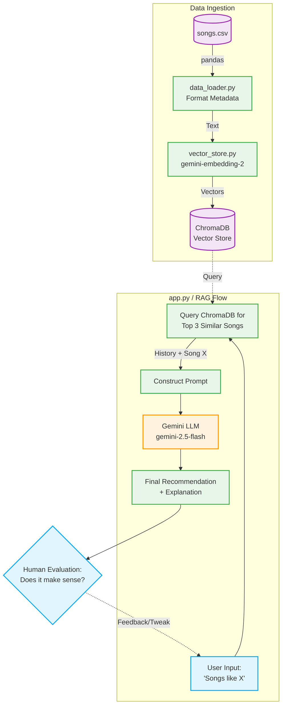

# Music Recommender RAG System Architecture

Below is the high-level system architecture for the Retrieval-Augmented Generation (RAG) Music Recommender you have built.

### 🧩 Main Components
1. **Data Loader (`data_loader.py`)**: Acts as the parser. It ingests your raw `songs.csv` and transforms the columns into a unified semantic text string (e.g., `"Sunrise City by Neon Echo [Genre: pop]"`).
2. **Embedder & Store (`vector_store.py` & ChromaDB)**: The system's **Retriever Engine**. It converts your text data into mathematical vectors using the `gemini-embedding-2` model and stores them locally in a persistent Chroma database.
3. **App Logic / Agent (`app.py`)**: The orchestrator. It manages the user interface, acts as the bridge to query the database, builds the custom context prompt, and communicates with the generation LLM.
4. **Generator (Google Gemini)**: The **Agent** generating the final response. It takes the retrieved history and user query via `gemini-2.5-flash` to synthesize a natural, bridging recommendation.

### 🔄 Data Flow (Input → Process → Output)
1. **Input**: You type a song name into the terminal (e.g., *"Summer Days"*).
2. **Process (Retrieval)**: The app queries ChromaDB for the 3 vectors mathematically closest to the input song.
3. **Process (Generation)**: The app packages those 3 retrieved songs into a prompt constraint: *"The user likes [Retrieved History]. They asked for [Input]. Suggest a bridge."*
4. **Output**: The LLM outputs a personalized recommendation with reasoning, which is printed to the terminal.

### 👨‍💻 Human / Testing Involvement
*   **Real-time Evaluation**: In this architecture, the human is the **Evaluator**. Because music taste is subjective, automated testing is difficult. The human user reads the LLM's explanation directly in the terminal and evaluates whether the "bridge" logically connects their listening history to their new request.
*   **Prompt Tuning**: Based on the AI's output, the human developer tests and tweaks the prompt logic inside `app.py` to get better, more accurate recommendations.
